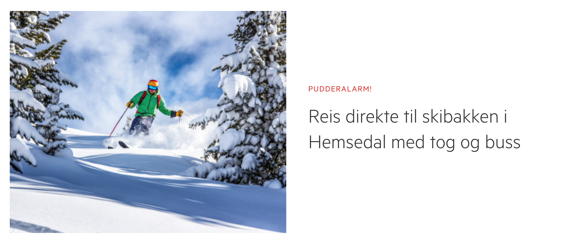

# NSB

Åpne opp `index.html` i nettleseren. Det er ikke så alt for langt unna, men det er ikke en perfekt kopi av nsb.no. La oss begynne med å fikse litt på headeren. Det ligger en litt styling i `style.css` allerede, men du kan godt bare lage dine egne selektorer under dette.

Noen ressurser:

- [A Complete Guide to Flexbox](https://css-tricks.com/snippets/css/a-guide-to-flexbox/)
- [flex-cheatsheet](https://yoksel.github.io/flex-cheatsheet/)

## Header

1. Sett `display: flex;` på `header`.
2. Bruk en annen flex-property for å midstille lenkene og knappene vertikalt.
3. Hvis man sammenligner med nsb.no, så skal "Logg inn"- og "Meny"-knappen være plassert til høyre. Et enkelt triks for å få til dette, er å sette `margin-left: auto` på det første elementet som skal plasseres til høyre.

De bruker faktisk `flex` på headeren på nsb.no også, men de har brukt en litt annen måte for å høyrestille knappene. Ta gjerne en kikk på dem og se om du forstår hva som skjer. [Denne artikkelen](https://medium.com/@tiffnogueira/understanding-flex-shrink-flex-grow-and-flex-basis-and-using-these-properties-to-their-full-e4b4afd2c930) har en ganske god forklaring av den propertien nsb.no bruker.

## Reiseplanlegger

1. Bruk flexbox for å få label-teksten til å legge seg over inputfeltene.

Nå vil du kanskje se at inputfeltene legger seg på to linjer. Dette er fordi et element med `display: flex` oppfører seg som et med `display: block`

2. Bruk flexbox for å på inputfeltene til å havne på samme linje igjen.

Nå gjenstår det to ting: Å midstille pil-ikonet mellom inputfeltene vertikalt, og å få inputfeltene til å fylle containeren.

3. Inspiser pil-ikonet. Høyden burde være som `label`-elementet. Dette skyldes at default-verdien av `align-items` er `stretch`, så bildet strekker seg. Dette kan vi fikse på to måter. Enten kan vi sette `height: 100%` på bildet, eller så kan vi sette `align-items: flex-start` på containeren, det vil gi samme resultat. Men i denne oppgaven ønsker vi å aligne bildet med med bunnen av inputfeltet, og ikke toppen av label-teksten. Så det smarteste her er å benytte `align-items: flex-end`.

4. _Valgfri_: Ikonet er fortsatt ikke helt midtstilt, men dette kan vi fikse med litt margin på bunnen. Inputfeltene har en fastsatt høyde, og bildet har en gitt størrelse, så det burde ikke være så alt for vanskelig å regne seg frem til hva denne marginen skal være :wink:

Selv om vi ikke ser dette i DOMen, har inputfelter en default attributt `size="20"` (nøyaktig tallverdi varierer i ulike nettlesere). Dette er mer ment som en funfact, men der er altså derfor inputfelter får en størrelse i det hele tatt.

5. For å få inputfeltene til å ta opp hele bredden til containeren, må vi la dem _vokse_. Kan du tenke deg en property som lar oss definere det? Og hvilket element må du sette denne propertien på?

## Artikkel

Bruk flexbox for å få artikkelen til å ligne på den som er på nsb.no.
Det kan hende du må legge til noen ekstra "wrapper-elementer" (`div`) for at ting skal oppføre seg riktig.

## Ferdig?

Ta en titt på [The Ultimate Guide to Flexbox  —  Learning Through Examples](https://medium.freecodecamp.org/the-ultimate-guide-to-flexbox-learning-through-examples-8c90248d4676), eller lek deg litt med [Flexbox Defense](http://www.flexboxdefense.com/)
